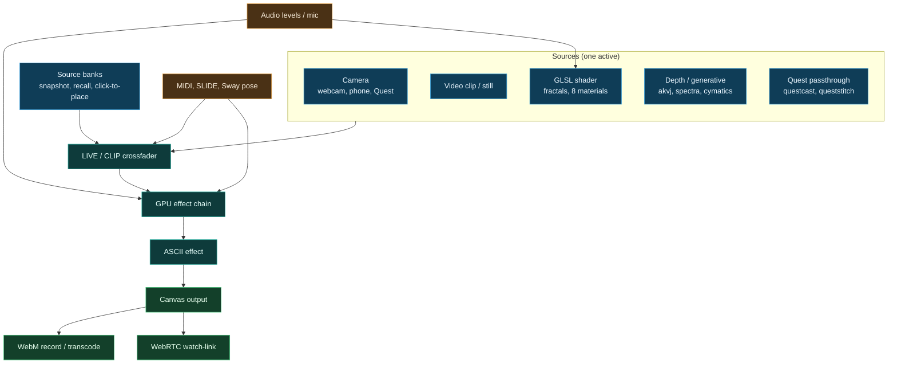

<h1 align="center">VJ-9000</h1>

<p align="center"><strong>by <a href="https://gantasmo.com">GANTASMO</a></strong></p>

<p align="center">
  <a href="https://react.dev/"></a>
  
  <a href="https://threejs.org/"></a>
  
  <a href="https://github.com/gantasmo/theDAW"></a>
  
</p>

<p align="center">
  <a href="https://open.spotify.com/artist/4q5n0QgK6mvyuw8FRzhuNA"></a>
  <a href="https://www.youtube.com/@GANTASMO"></a>
  <a href="https://www.instagram.com/gantasmo"></a>
  <a href="https://gantasmo.com"></a>
</p>

VJ-9000 is a browser-based, audio-reactive visual engine for live performance. It renders live cameras, video clips, generated sources, and still images through a real-time WebGL effects stack with MIDI-mappable controls and audio reactivity. It runs standalone in a browser and serves as the live-visuals engine embedded in [theDAW](https://github.com/gantasmo/theDAW).

## Pipeline



## Sources

A single active source feeds the effect chain, and the LIVE/CLIP crossfader blends a live source against a loaded clip.

- **Cameras.** A local webcam or capture card, and a phone, tablet, or headset camera reached over the LAN through a URL and QR code.
- **Clips and stills.** Video clips and image backdrops, loaded by drag-and-drop or a file picker.
- **GLSL shader.** A generic shader source on the atzedent uniform convention, currently a Menger flythrough plus four distance-field fractals (Mandelbulb, Julia, Mandelbox, kaleidoscopic IFS). Each exposes editable, audio-mappable params and a Hue control, and a global Material picker (Neon, Chrome, Matte, Glass, Gold, Iridescent, Velvet, Plasma) reshades the scene.
- **Depth and generative.** Cymatics, an akvj depth point cloud, and a spectra source, all reactive to the audio.
- **Quest passthrough.** A Quest 3 headset view arrives as a live source through theDAW's `questcast` and `queststitch` bridges.
- **Source banks.** Snapshot the live source into a bank slot, or click an empty slot to place a clip, a source, or a local file at the click point, then recall it during a set.

## Effects

A composable GPU chain, every node MIDI-mappable, with a SOLO mode that isolates one effect for setup. The ASCII effect renders the live output through a glyph atlas as a post pass.

- **Color and optics:** hue, saturation, contrast, brightness, invert, edge detect.
- **Geometry:** mirror X/Y, kaleidoscope, radial mirror, tiling, equirectangular 360, stereo side-by-side and top-bottom, soft edges.
- **Generative:** reaction-diffusion (Gray-Scott), SDF raymarch portal, topographic isolines, fluid displacement.
- **Depth:** depth fog, tilt-shift miniature, z-quantized plane splits, and depth-edge outline from a luminance depth proxy.
- **Distortion and glitch:** feedback, glitch, RGB ghost and split, chromatic aberration, buffer backskip, strobe, pixelate, wave warp.
- **Time:** playback speed, reverse, posterize-time, echo trails, slit-scan, time displacement.
- **Post:** scanlines, vignette, CRT, the ASCII effect, and CSS-filter looks for sepia, grayscale, and blur.

## Performance

- **Reactivity.** Audio reactivity from the host player's levels or a local microphone, BPM sync, an auto-LFO, and an Autopilot that sequences effects and clip switches.
- **Control.** Every control is MIDI-mappable, the host's SLIDE surface stays in two-way sync, and the Sway pose control bus drives parameters from camera-tracked motion.
- **Recording.** Captures the live canvas to WebM (VP9 and Opus) at 720p, 1080p, or 4K. Embedded in theDAW, the take transcodes to H.264, H.265, ProRes, or a PNG sequence.
- **Broadcast.** A WebRTC watch-link streams the live output and audio to remote viewers.
- **Performance.** Render-scale tiers trade sharpness for frame rate, and the render loop parks near zero GPU when the host tab is backgrounded.

## Integration

Inside theDAW's VJ tab, VJ-9000 runs in an iframe and communicates with the host over `postMessage`:

- theDAW streams its master-player audio levels at about 30 fps so the visuals react to whatever is playing, forwards MIDI, and pushes track metadata and play/pause state.
- The host's SLIDE tab stays in two-way sync with VJ-9000's controls, so a fader moved in either place updates the other.
- Clips and images imported into VJ-9000 upload to theDAW's library, and their session `blob:` URLs are replaced with stable library URLs so a cue survives a reload.
- A LAN URL and QR code make the output reachable from a phone or tablet on the same network for a second screen or a camera source.

## Development

Prerequisites: Node.js.

```bash
npm install

# Development with HMR:
npm run dev

# Production build and serve (how theDAW runs it):
npm run build
npm run preview
```

theDAW spawns this app automatically as a sidecar, so a manual run is only needed when developing VJ-9000 itself.

---

<p align="center">
  <a href="https://open.spotify.com/artist/4q5n0QgK6mvyuw8FRzhuNA"></a>
  <a href="https://www.youtube.com/@GANTASMO"></a>
  <a href="https://www.instagram.com/gantasmo"></a>
  <a href="https://x.com/gantasmo"></a>
  <a href="https://gantasmo.com"></a>
</p>

<p align="center"><sub>VJ-9000 is part of <a href="https://github.com/gantasmo/theDAW">theDAW</a>, made by <a href="https://github.com/danieljtrujillo">Daniel Joaquin Trujillo</a> and <a href="https://github.com/StarskreamEXE">Josh Valenzuela</a> as GANTASMO.</sub></p>
